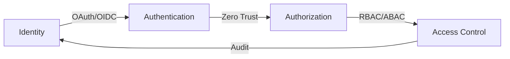

<h1 align="center">⚡ SECURE SYSTEM ARCHITECTURE ZONE ⚡</h1>

<p align="center">
  
</p>

```ascii
+------------------------------------------+
|             G4br1e3l's REALM             |
|    Breaking Systems to Protect Them       |
+------------------------------------------+
```

## 🔐 Identity & Access Arsenal

```python
class SecurityEngineer:
    def __init__(self):
        self.specialization = "IAM & Authorization"
        self.focus_areas = {
            "identity": ["OAuth 2.0", "OIDC", "SAML", "JWT"],
            "access_control": ["RBAC", "ABAC", "PAM"],
            "zero_trust": ["MFA", "Continuous Verification"],
            "infrastructure": ["IaC", "Cloud Security"]
        }
        self.status = "Securing the Digital Frontier"
```

## 🛡️ Tech Battle Station

<p align="center">
  
  
  
  
  
</p>

## ⚔️ Security Arsenal



## 🎯 Current Security Operations

- 🔒 Architecting: Zero Trust Infrastructure
- 🛡️ Implementing: Cloud-Native IAM Solutions
- 🔐 Researching: Next-Gen Authorization Frameworks
- ⚡ Building: Automated Security Controls

## 💻 Battle Stats

<div align="center">
  
</div>

## 🔥 Security Engineering Principles

- ⚡ Zero Trust Architecture First
- 🔒 Least Privilege by Default
- 🛡️ Defense in Depth
- ⚔️ Continuous Security Monitoring

## 🌐 Infrastructure Territory

```javascript
const infrastructure = {
    cloud: ["AWS", "Azure", "GCP"],
    security_tools: ["Okta", "Auth0", "KeyCloak"],
    monitoring: ["ELK", "Prometheus", "Grafana"],
    automation: ["Terraform", "Ansible", "CloudFormation"],
    containers: ["Docker", "Kubernetes", "ECS"]
};
```

## ⚡ Connect with the Security Force

<p align="center">
  <a href="https://linkedin.com/in/G4br1e3l"></a>
  <a href="https://twitter.com/G4br1e3l"></a>
</p>

<div align="center">
  
</div>

---
<h3 align="center">⚠️ SECURITY IS NOT A PRODUCT, IT'S A PROCESS ⚠️</h3>

<p align="center">⚡ From [G4br1e3l](https://github.com/G4br1e3l) ⚡</p>
